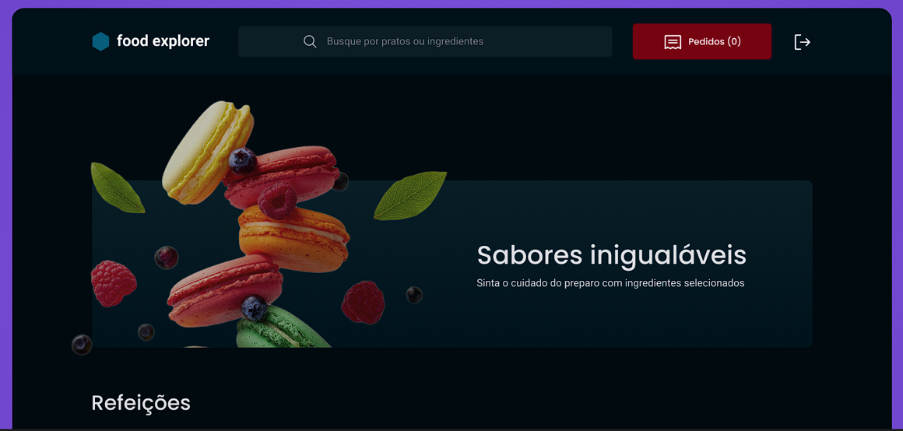

<h1 align="center"> FoodExplorer </h1>

  Exclusive event promoted by Rocketseat for teaching WEB technologies.

## 📖 Index

  <a href="#-technologies">Technologies</a>&nbsp;&nbsp;&nbsp;|&nbsp;&nbsp;&nbsp;
  <a href="#-functionalities">Functionalities</a>&nbsp;&nbsp;&nbsp;|&nbsp;&nbsp;&nbsp;
  <a href="#-project">Project</a>&nbsp;&nbsp;&nbsp;|&nbsp;&nbsp;&nbsp;
  <a href="#-layout">Layout</a>&nbsp;&nbsp;&nbsp;|&nbsp;&nbsp;&nbsp;
  <a href="#-learning">Learning</a>&nbsp;&nbsp;&nbsp;|&nbsp;&nbsp;&nbsp;
  <a href="#memo-license">License</a>

  

 

  

## 💻 Project

FoodExplorer is an application, where an Admin User creates dishes, view details, edit and delete dishes while the common user can view the details of the dish and place the order.

<strong>To create an Admin User, enter the word "admin" in the email. Example: useradmin@email.com.</strong>

<strong>Project link</strong> : [FoodExplorer](https://food-explorerfront.netlify.app)

## 🚀 Technologies

This project was developed with the following technologies:

- HTML.
- ReactJs. 
- Axios.
- Framer Motion.
- Styled Components.
- Git and GitHub.

## 👾 Functionalities

This project has the following functionalites:

- Creating Users and Admin.
- Creation of Dishes,Drinks and (<strong>only an Admin User can create</strong>).
- Functionality to search dishes, desserts and drinks.
- An Admin User can edit dishes.
- An Admin User can delete a dish.
- User and Admin can view details of a dish, drink or dessert.

## 🔖 Layout

You can view the project through layout [THIS LINK](https://www.figma.com/community/file/1196874589259687769). Is necessary an acount [Figma](https://figma.com) for access it.  

## 🧠 Learning

In this project i learned;

- ReactJs.
- Styled Components.
- Componentization.
- Routes in ReactJs.
- CSS in JS.
- Template Literals in CSS.
- Conditional in CSS.
- Animations with Framer Motion.

## :memo: License

This project is lincensed under MIT.

---
